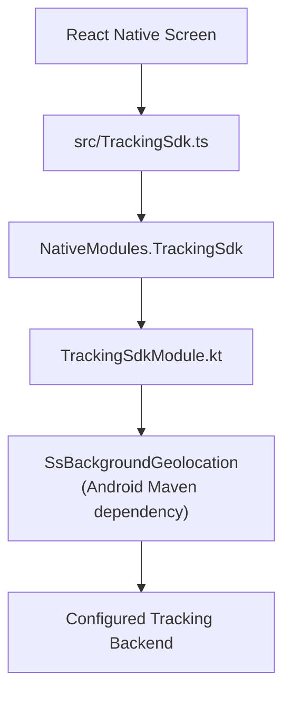

# Sovereign Solutions Tracking SDK Integration for React Native Android

Sovereign Solutions • Android Integration Guide

This guide integrates Sovereign Solutions Tracking SDK into a React Native Android application using the Kotlin bridge included in this repository. It covers configuration, permissions, authentication, starting and stopping tracking, and troubleshooting.

The examples describe the repository's current implementation: `com.sovereignsolutions:tracking-sdk:3.0.4`. SDK behavior beyond the exposed bridge methods must be confirmed with the SDK provider.


## 1. Prerequisites and Integration Structure

Use a React Native project with an editable native `android/` project and a configured Android development environment. Obtain Maven repository credentials, tracking API configuration, and a valid tracking username from your SDK/backend administrator. For caller-managed authentication, also obtain a valid access token and complete any required backend registration.

The reference project's versions are listed below. These are its configured versions, not a compatibility matrix or the SDK's independently verified minimum requirements.

| Component | Reference Configuration |
| :--- | :--- |
| React Native | `0.85.3` |
| React | `19.2.3` |
| Node.js | `>= 22.11.0` |
| Android Minimum SDK | `24` (Android 7.0) |
| Android Compile / Target SDK | `36` / `36` |
| Android Build Tools | `36.0.0` |
| Kotlin | `2.1.20` |
| Android NDK | `27.1.12297006` |

> [!NOTE]
> Keep the React Native template's compatible JDK, Gradle, and Android Gradle Plugin versions. The native bridge checks for Android API 23+, but this example application has a higher minimum of API 24.

### Architecture Flow

```text
React Native screen
  -> src/TrackingSdk.ts
  -> NativeModules.TrackingSdk
  -> TrackingSdkModule.kt
  -> SsBackgroundGeolocation (Android Maven dependency)
  -> Configured tracking backend
```



The tracking integration uses a Maven dependency and a local native bridge. The Map SDK npm package used elsewhere in this app is not referenced by this tracking bridge.

---

## 2. Configure the Maven Repository

Merge the following repositories into `android/settings.gradle`. Preserve your existing React Native plugin configuration and any repositories needed by other dependencies. Do not create a second `dependencyResolutionManagement` block if one already exists.

```groovy
dependencyResolutionManagement {
    repositoriesMode.set(RepositoriesMode.PREFER_SETTINGS)
    repositories {
        google()
        mavenCentral()
        maven {
            url "https://developer.huawei.com/repo/"
        }
        maven {
            name = "sstrackingAndroid"
            url = uri("https://artifact.sovereignsolutions.tech/artifactory/sstracking-android")
            credentials {
                username = providers.gradleProperty("artifactory_user").get()
                password = providers.gradleProperty("artifactory_password").get()
            }
        }
    }
}
```

Put credentials in your user-level `~/.gradle/gradle.properties`, outside the repository:

```properties
artifactory_user=YOUR_REPOSITORY_USERNAME
artifactory_password=YOUR_REPOSITORY_PASSWORD
```

> [!TIP]
> For CI, provide the same Gradle properties through protected environment variables named `ORG_GRADLE_PROJECT_artifactory_user` and `ORG_GRADLE_PROJECT_artifactory_password`.

Add the dependency in `android/app/build.gradle`:

```groovy
dependencies {
    implementation "com.sovereignsolutions:tracking-sdk:3.0.4"
    // Keep your existing React Native and other dependencies.
}
```

---

## 3. Configurations from Caller App

The Android bridge reads configuration from the app's generated `BuildConfig`. Merge these settings into `android/app/build.gradle`, replacing every placeholder with the values for one environment:

```groovy
android {
    buildFeatures {
        buildConfig = true
    }
    defaultConfig {
        buildConfigField "String", "TRACKING_BASE_URL", '"https://auth.example.com/"'
        buildConfigField "String", "TRACKING_REGISTRATION_BASE_URL", '"https://registration.example.com/"'
        buildConfigField "String", "TRACKING_SERVER_URL", '"https://tracking.example.com/api/app-base/vdms-tracking/push"'
        buildConfigField "String", "TRACKING_API_KEY", '"YOUR_API_KEY"'
        buildConfigField "String", "TRACKING_CLIENT_ID", '"YOUR_CLIENT_ID"'
        buildConfigField "String", "TRACKING_TENANT_NAME", '"YOUR_TENANT_NAME"'
    }
}
```

These URLs are illustrative. Use the exact base URLs and push endpoint supplied for your deployment; keep the trailing slash on base URLs. All six fields must exist so the Kotlin bridge compiles, including fields that may be empty in caller-managed authentication mode.

| Field | Purpose | Nonblank Value Required by Bridge |
| :--- | :--- | :--- |
| `TRACKING_BASE_URL` | Authentication and tracking API base URL | Both modes |
| `TRACKING_REGISTRATION_BASE_URL` | Login/registration backend base URL | SDK-managed authentication |
| `TRACKING_SERVER_URL` | Full location push URL | Both modes |
| `TRACKING_API_KEY` | SDK authentication API key | SDK-managed authentication |
| `TRACKING_CLIENT_ID` | Client identifier | SDK-managed authentication |
| `TRACKING_TENANT_NAME` | Backend tenant | Both modes |

> [!WARNING]
> Use build variants or CI-supplied configuration to separate environments. Keep production values out of committed examples. Values compiled into `BuildConfig` are part of the APK and are **not** secret storage.

---

## 4. Install and Register the Kotlin Bridge

Copy these complete files from this repository into your application:
- [`TrackingSdkModule.kt`](android/app/src/main/java/sovereignsolutions/TrackingSdkModule.kt)
- [`TrackingSdkPackage.kt`](android/app/src/main/java/sovereignsolutions/TrackingSdkPackage.kt)

For an application with Android namespace `com.example.myapp`, place them under `android/app/src/main/java/com/example/myapp/` and change the first line of both files to:

```kotlin
package com.example.myapp
```

> [!IMPORTANT]
> Use the app's Android namespace, which determines the generated `BuildConfig` package. If the bridge lives in another package, explicitly import your app's `BuildConfig` and import `TrackingSdkPackage` in `MainApplication.kt`.

Register the package in the existing package list in `MainApplication.kt`. This is the pattern used by this repository:

```kotlin
override val reactHost: ReactHost by lazy {
    getDefaultReactHost(
        context = applicationContext,
        packageList = PackageList(this).packages.apply {
            add(TrackingSdkPackage())
        },
    )
}
```

Required imports for that snippet:

```kotlin
import com.facebook.react.PackageList
import com.facebook.react.ReactHost
import com.facebook.react.defaults.DefaultReactHost.getDefaultReactHost
```

Retain the rest of your template's application setup, including its `onCreate()`. If your template uses `getPackages()` instead, add `TrackingSdkPackage()` to that package list. Register it only once. This local bridge is manually registered; adding the Maven dependency alone does not expose a JavaScript module.

The bridge exports the exact name `TrackingSdk`. Its initialization maps configuration to the SDK like this (excerpt from the complete bridge):

```kotlin
trackingSdk.initSDK(
    baseUrl = BuildConfig.TRACKING_BASE_URL,
    registrationBaseUrl = BuildConfig.TRACKING_REGISTRATION_BASE_URL,
    serverUrl = BuildConfig.TRACKING_SERVER_URL,
    apiKey = BuildConfig.TRACKING_API_KEY,
    username = cleanUsername,
    clientId = BuildConfig.TRACKING_CLIENT_ID,
    tenantName = BuildConfig.TRACKING_TENANT_NAME,
    distanceFilter = distanceFilter.toFloat(),
    skipLoginAndRegistration = skipLoginAndRegistration,
    callerAccessToken = cleanCallerAccessToken
) { success, token, error ->
    // The complete bridge handles errors and calls startTracking on success.
}
```

Use the complete linked files, which include activity binding, Promise handling, state persistence, and device health reporting.

---

## 5. Android Manifest and Runtime Permissions

Ensure these declarations are present in the merged app manifest. They belong directly inside `<manifest>`, outside `<application>`:

```xml
<uses-permission android:name="android.permission.INTERNET" />
<uses-permission android:name="android.permission.ACCESS_COARSE_LOCATION" />
<uses-permission android:name="android.permission.ACCESS_FINE_LOCATION" />
<uses-permission android:name="android.permission.ACCESS_BACKGROUND_LOCATION" />
<uses-permission android:name="android.permission.ACTIVITY_RECOGNITION" />
<uses-permission android:name="android.permission.FOREGROUND_SERVICE" />
<uses-permission android:name="android.permission.FOREGROUND_SERVICE_LOCATION" />
<uses-permission android:name="android.permission.POST_NOTIFICATIONS" />
```

The source manifest in this repository explicitly declares only `INTERNET`; its existing generated debug manifest includes the location permissions and location services through manifest merging. Inspect Android Studio's **Merged Manifest** for your own build. Preserve SDK-provided services and receivers; do not invent or duplicate service class declarations. A location foreground service needs the appropriate location service type and location permission prerequisites. Start tracking while the app's activity is visible. See [Android's location foreground service requirements](https://developer.android.com/develop/background-work/services/fgs/service-types#location).

Request foreground location before background location. On Android 11+, background access is granted through settings; explain the reason and allow the user to decline. Approximate foreground access also limits background accuracy. See [Android's background location guidance](https://developer.android.com/develop/sensors-and-location/location/permissions/background).

On Android 13+, request notification permission to show tracking notifications normally. Android does not require this grant to launch a foreground service, although the service must still supply a notification. The repository's duty screen uses a stricter rule that blocks tracking when notifications are denied. See [Android's notification permission guidance](https://developer.android.com/develop/ui/compose/notifications/notification-permission).

Create `src/trackingPermissions.ts` for this sample. It requires precise location and background access for its tracking workflow. It returns `false` after opening settings; the user returns to the app and taps **Start** again to recheck permissions.

```typescript
import {Alert, Linking, PermissionsAndroid, Platform} from 'react-native';

function offerSettings(message: string): void {
  Alert.alert('Tracking permissions', message, [
    {text: 'Cancel', style: 'cancel'},
    {
      text: 'Open settings',
      onPress: () => {
        Linking.openSettings().catch(() => {
          Alert.alert('Settings unavailable', 'Open app settings manually.');
        });
      },
    },
  ]);
}

export async function requestTrackingPermissions(): Promise<boolean> {
  if (Platform.OS !== 'android') {
    return false;
  }

  const p = PermissionsAndroid.PERMISSIONS;
  const granted = PermissionsAndroid.RESULTS.GRANTED;
  const apiLevel = Number(Platform.Version);

  const location = await PermissionsAndroid.requestMultiple([
    p.ACCESS_COARSE_LOCATION,
    p.ACCESS_FINE_LOCATION,
  ]);

  if (location[p.ACCESS_FINE_LOCATION] !== granted) {
    offerSettings('Enable precise location to use this tracking example.');
    return false;
  }

  if (apiLevel >= 29) {
    // Motion recognition is requested separately from location.
    await PermissionsAndroid.request(p.ACTIVITY_RECOGNITION);

    const backgroundGranted = await PermissionsAndroid.check(
      p.ACCESS_BACKGROUND_LOCATION,
    );

    if (!backgroundGranted) {
      if (apiLevel >= 30) {
        offerSettings(
          'Tracking needs location while the app is in the background. ' +
            'In app settings, open Location and select Allow all the time. ' +
            'Then return and tap Start again.',
        );
        return false;
      }

      const background = await PermissionsAndroid.request(
        p.ACCESS_BACKGROUND_LOCATION,
      );

      if (background !== granted) {
        return false;
      }
    }
  }

  if (apiLevel >= 33) {
    await PermissionsAndroid.request(p.POST_NOTIFICATIONS);
  }

  return true;
}
```

The helper allows notification and motion permission denial; use device health to explain any degraded behavior. The SDK can still report its own startup errors. Location services must also be enabled on the device.

---

## 6. Add the TypeScript Wrapper

Copy [`src/TrackingSdk.ts`](src/TrackingSdk.ts) into your project at the same path. Android configuration comes exclusively from `BuildConfig`; the iOS configuration object in that file is not used on Android.

The public initialization signature is:

```typescript
initAndStartTracking(
  username: string,
  skipLoginAndRegistration: boolean,
  callerAccessToken: string | null = null,
  distanceFilter: number = 50,
): Promise<any>
```

The wrapper trims the username and rejects blank usernames, negative/nonfinite distance filters, and missing tokens when skipping authentication. `distanceFilter` is passed to the SDK as a float; confirm its units and collection semantics with your SDK version's provider documentation. It is not an upload interval exposed by this bridge.

> [!NOTE]
> The native argument order differs from the public wrapper order. Use the wrapper in application code:
>
> ```typescript
> // Public wrapper order:
> await initAndStartTracking('driver-001', false, null, 50);
>
> // Equivalent native order, for reference only:
> // NativeModules.TrackingSdk.initAndStartTracking('driver-001', 50, false, null);
> ```

### Authentication Mode A: SDK-Managed Login and Registration

```typescript
import {initAndStartTracking} from './src/TrackingSdk';

await initAndStartTracking('driver-001', false, null, 50);
```

Configure all six backend fields. The bridge asks the SDK to perform its login/registration flow, then starts tracking only after initialization succeeds.

### Authentication Mode B: Caller-Provided Access Token

```typescript
import {initAndStartTracking} from './src/TrackingSdk';

export async function startWithSession(username: string, accessToken: string) {
  return initAndStartTracking(username, true, accessToken, 50);
}
```

Pass a valid token from your application's authentication flow. The SDK is instructed to skip login and registration, so complete any required registration beforehand. Token format, expiry, and renewal must match the backend contract. This Android bridge does not expose a token replacement or refresh method; agree on a supported renewal flow with the SDK provider before relying on long-running caller-managed sessions.

Normal initialization success resolves to:

```json
{
  "success": true,
  "message": "Tracking started successfully",
  "accessToken": "...",
  "skipLoginAndRegistration": false,
  "username": "driver-001",
  "distanceFilter": 50
}
```

> [!CAUTION]
> Avoid logging this object because it includes an access token. A duplicate initialization while another is running resolves with only success and an "already in progress" message; that response does not confirm that startup completed. Serialize actions and check the current state.

---

## 7. Example React Native Screen

After adding the two TypeScript files above, this can be used as a minimal Android `App.tsx`. Replace the username with the authenticated user's identifier. This example uses SDK-managed authentication.

```tsx
import React, {useRef, useState} from 'react';
import {Alert, Button, Text, View} from 'react-native';
import {
  getDeviceHealth,
  getTrackingState,
  initAndStartTracking,
  stopTracking,
} from './src/TrackingSdk';
import {requestTrackingPermissions} from './src/trackingPermissions';

export default function App() {
  const [busy, setBusy] = useState(false);
  const [status, setStatus] = useState('Not checked');
  const actionRunning = useRef(false);

  async function run(action: () => Promise<void>) {
    if (actionRunning.current) {
      return;
    }
    actionRunning.current = true;
    setBusy(true);
    try {
      await action();
    } catch (error) {
      const message = error instanceof Error ? error.message : String(error);
      Alert.alert('Tracking error', message);
    } finally {
      actionRunning.current = false;
      setBusy(false);
    }
  }

  async function start() {
    if (!(await requestTrackingPermissions())) {
      setStatus('Permissions required – grant access, then retry');
      return;
    }
    await initAndStartTracking('driver-001', false, null, 50);
    setStatus((await getTrackingState()) ? 'Tracking active' : 'Tracking inactive');
  }

  async function stop() {
    await stopTracking();
    setStatus('Tracking stopped');
  }

  async function checkHealth() {
    const health = await getDeviceHealth();
    Alert.alert(
      'Device health',
      health ? JSON.stringify(health, null, 2) : 'Health unavailable',
    );
  }

  return (
    <View style={{padding: 24, gap: 12}}>
      <Text style={{fontSize: 16, fontWeight: 'bold'}}>{status}</Text>
      <Button title="Start" disabled={busy} onPress={() => void run(start)} />
      <Button title="Stop" disabled={busy} onPress={() => void run(stop)} />
      <Button
        title="Check device health"
        disabled={busy}
        onPress={() => void run(checkHealth)}
      />
    </View>
  );
}
```

For the application's fuller UI flow, see [`DutyTrackingScreen.tsx`](src/screens/DutyTrackingScreen.tsx).

---

## 8. Available Android API and Lifecycle Behavior

| Wrapper Function | Android Behavior in this Repository |
| :--- | :--- |
| `initAndStartTracking(username, skip, token?, distance?)` | Initializes the SDK and starts tracking; returns an object |
| `stopTracking()` | Stops tracking; normally resolves to `"Tracking stopped"` |
| `getTrackingState()` | Queries native SDK state; wrapper returns `false` if unavailable or on error |
| `getSavedTrackingStatus()` | Reads locally saved `{enabled, username}`; native username may be `null` |
| `getDeviceHealth()` | Returns device health flags; wrapper returns `null` on failure |

> [!WARNING]
> Although `src/TrackingSdk.ts` also exports `startTracking`, `syncTracking`, `refreshAccessToken`, and `destroyTrackingSdk`, the current Kotlin module does **not** implement those methods. Their Android wrapper calls throw an unavailable-method error. Do not use them without adding the matching native methods against the SDK's documented API. To start through the currently supported API, use `initAndStartTracking`.

The saved status is a `SharedPreferences` snapshot, not proof that tracking is currently running or that a location reached the server:

```typescript
import {getSavedTrackingStatus, getTrackingState} from './src/TrackingSdk';

const saved = await getSavedTrackingStatus();
const username = saved.username ?? '';
const active = await getTrackingState();

// Use saved data to restore UI context; use active to display queried state.
```

The wrapper's state fallback cannot distinguish an inactive SDK from a query error. For diagnostics requiring that distinction, inspect the native error or adapt the wrapper to propagate it.

Initialize/start/stop/state operations bind to the current Android activity. Call them while the app is foregrounded, not from a headless task. On relaunch, recheck state and permissions before deciding to initialize again. The bridge does not itself implement automatic restart after process death or reboot. Verify any such SDK behavior on devices; do not infer it from the saved flag.

Stopping tracking leaves the saved username in preferences. Native module invalidation removes its listener and reference but does not explicitly stop tracking. For an explicit end-of-duty or logout flow, await `stopTracking()` before completing that action. Navigating away from a screen alone is not a stop request.

### Device Health Fields

| Field | Interpretation |
| :--- | :--- |
| `locationPermissionOff` | Location permission is unavailable |
| `preciseLocationOff` | Precise location is unavailable |
| `backgroundLocationPermissionOff` | Background location permission is unavailable |
| `locationServiceOff` | Device location services are off |
| `batteryOptimizationEnabled` | Battery optimization is enabled |
| `motionActivityDisabled` | Motion/activity recognition is disabled |
| `autoStartManagementAvailable` | Device has an auto-start management mechanism |
| `autoStartStatus` | `UNKNOWN` or `NOT_APPLICABLE`; not confirmation that auto-start is enabled |

The bridge reports these values; it does not change the device settings. Interpret them as diagnostics rather than automatically treating every flag as a fatal startup error.

---

## 9. Build and Validate

Install your app's JavaScript dependencies with its package manager. For this repository:

```bash
yarn install
yarn start
```

In another terminal at the project root:

```bash
yarn android
```

> [!NOTE]
> Rebuild the Android app after changing Gradle configuration, Kotlin files, or package registration; Metro reload alone does not install native changes.

To check dependency resolution and build without launching the app:

```bash
cd android
./gradlew :app:dependencies --configuration debugRuntimeClasspath
./gradlew :app:assembleDebug
```

Inspect the bridge logs on a connected device:

```bash
adb logcat -s TrackingSdkModule ReactNativeJS
```

### Validation Checklist

Validate on a physical Android device:

1. **Foreground Startup**: Start from a visible screen, grant permissions, and confirm the tracking state becomes enabled.
2. **Backend Ingestion**: Confirm locations arrive for the expected username and tenant in the backend. A resolved startup Promise alone does not verify delivery.
3. **Background Tracking**: Move the device and test background/screen-off behavior.
4. **Stop Verification**: Stop tracking and confirm the state becomes disabled.
5. **Degraded Scenarios**: Test permission denial, approximate location, disabled location services, and returning from settings.
6. **Network & Recovery**: Test relaunch, connectivity loss/recovery, and token expiry using your backend's expected behavior.
7. **Release Packaging**: Validate the signed release build and any shrinking configuration separately; this example disables release minification.

---

## 10. Troubleshooting

| Symptom / Code | What to Check |
| :--- | :--- |
| Maven 401/403 or dependency resolution failure | Repository access, Gradle credential properties (`artifactory_user`, `artifactory_password`), repository URL, and artifact version |
| `TrackingSdk` native module not found | Both bridge files copied, package registered once, correct namespace/imports, full Android rebuild |
| Unresolved `BuildConfig.TRACKING_*` | All six fields defined in app module; `buildConfig = true` enabled; correct `BuildConfig` import |
| `USERNAME_REQUIRED` | Supply a nonblank username |
| `INVALID_DISTANCE_FILTER` | Supply a finite number `>= 0` |
| `CALLER_ACCESS_TOKEN_REQUIRED` | Supply a nonblank token when skip mode is `true` |
| `SDK_CONFIGURATION_ERROR` | Check required values for the selected authentication mode |
| `INIT_SDK_ERROR` | Inspect initialization error, backend configuration, authentication and registration |
| `START_TRACKING_ERROR` | Inspect SDK error, permissions, device location services, and foreground activity |
| `INIT_START_EXCEPTION` / "Current activity is null" | Invoke from an active foreground screen; inspect native exception |
| `STOP_TRACKING_ERROR` / `STOP_TRACKING_EXCEPTION` | Inspect SDK stop error and activity availability |
| `GET_STATE_ERROR` / `GET_STATE_EXCEPTION` | Native state query failed; TypeScript wrapper masks it as `false` |
| `DEVICE_HEALTH_ERROR` | Native health query failed; wrapper returns `null` |
| Tracking enabled but no server records | Verify network access, push endpoint, token validity, username/tenant, and backend logs |
| Background access still denied | Grant background access separately in settings and retry after returning |
| Method "is not available in Android native module" | Check the supported API table; several wrapper methods (`startTracking`, `syncTracking`, `refreshAccessToken`, `destroyTrackingSdk`) are not implemented on Android |
