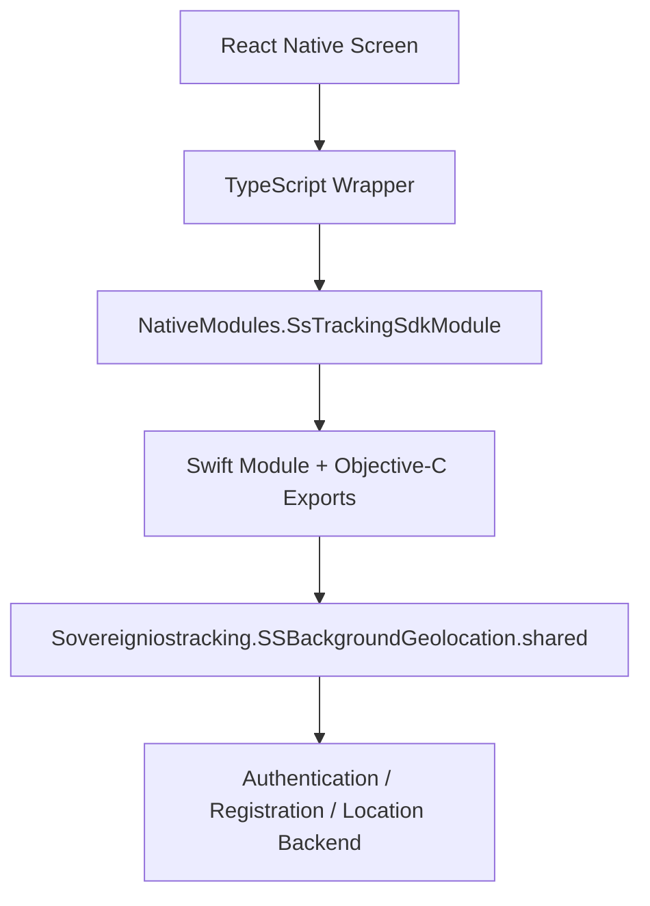

# Sovereign Solutions Tracking SDK Integration for React Native iOS

Sovereign Solutions • iOS Integration Guide

This guide explains how to integrate the iOS Sovereign Solutions Tracking SDK into a React Native application, configure background location, expose native methods to JavaScript, and start and stop tracking. It follows the Swift bridge, Objective-C exports, TypeScript wrapper, and installed SDK in this repository.

## 1. Architecture and Prerequisites

### Architecture Flow

```text
React Native screen
  -> TypeScript wrapper
  -> NativeModules.SsTrackingSdkModule
  -> Swift module + Objective-C React Native exports
  -> Sovereigniostracking.SSBackgroundGeolocation.shared
  -> Authentication / registration / location upload backend
```



You need a Mac with Xcode, the React Native project's Node and Ruby toolchains, CocoaPods, an editable native iOS project, access to the private SDK artifact, and backend configuration. Use a physical iPhone for background tracking validation. This is a native integration; it requires rebuilding the iOS application.

| Component | Observed Reference Configuration |
| :--- | :--- |
| React Native | `0.85.3` |
| iOS SDK Pod / Swift Import | `Sovereigniostracking` |
| SDK Version | `0.0.10` |
| Native Singleton | `SSBackgroundGeolocation.shared` |
| JavaScript Module Name | `SsTrackingSdkModule` |
| React Native Minimum (from installed scripts) | iOS 15.1 |
| SDK Podspec Declared Minimum | iOS 14.0 |
| Installed Device Framework Actual Minimum | iOS 18.5 |
| Available Framework Slices | iOS arm64; simulator arm64 / x86_64 |
| SDK Dependency Declared in Podspec | `CocoaLumberjack` |

### Resolve the Deployment Target Mismatch First

> [!WARNING]
> **Deployment Target Mismatch**: The installed `0.0.10` device binary's `LC_BUILD_VERSION` reports `minos 18.5`; its framework `Info.plist` also reports `MinimumOSVersion = 18.5`. This is stronger evidence than the podspec's iOS 14.0 declaration. The application's current target settings include iOS 15.0 and project settings include 15.1, so those settings are inconsistent with this installed binary.

For this artifact, configure the app and Podfile for **iOS 18.5 or later**. If your product must support earlier versions, obtain a framework rebuilt for that minimum from the SDK provider. Lowering a Podfile value or suppressing a warning cannot lower a precompiled binary's minimum OS.

Use an Xcode toolchain compatible with the supplied framework. The installed Swift interface identifies Swift 6.3.3; the locally available Xcode is 27.0. These are observations, not a verified minimum Xcode requirement. Confirm the supported Xcode range with the provider if a module compatibility error occurs.

---

## 2. Add the SDK with CocoaPods

Preserve the React Native Podfile template, its `use_react_native!` call, and `react_native_post_install` hook. Set the platform for the installed artifact:

```ruby
platform :ios, '18.5'
```

Inside your application's target, add the pod. Replace `YourApp` with your target name; this repository uses `SampleMap`.

```ruby
target 'YourApp' do
  config = use_native_modules!
 
  use_react_native!(
    :path => config[:reactNativePath],
    :app_path => "#{Pod::Config.instance.installation_root}/.."
  )
 
  pod 'Sovereigniostracking',
      :http => ENV.fetch('SS_TRACKING_IOS_ARTIFACT_URL')
 
  # Keep your existing post_install hook here.
end
```

Provide `SS_TRACKING_IOS_ARTIFACT_URL` in the environment before installing pods. The artifact path used by this project, without credentials, is:

```text
https://artifact.sovereignsolutions.tech/artifactory/sstracking-ios-tracking/Sovereigniostracking/0.0.10/Sovereigniostracking-0.0.10.tar.gz
```

Obtain the authorized download method from your SDK administrator. The reference project uses an authenticated HTTP archive URL. If authentication is embedded in the supplied URL, provide it through your protected local/CI environment instead of copying real credentials into this guide.

> [!CAUTION]
> CocoaPods may record authorized download URLs with credentials in `Podfile.lock`, caches, or logs; environment injection alone does not prevent that persistence. Inspect these outputs before sharing or committing them.

Set the app target's **iOS Deployment Target** to **18.5 or later** for every configuration. This project's existing post-install loop resets pod deployment targets to React Native's minimum. If retaining that loop for this artifact, update its assigned value to match the chosen minimum:

```ruby
installer.pods_project.targets.each do |pod_target|
  pod_target.build_configurations.each do |build_config|
    build_config.build_settings['IPHONEOS_DEPLOYMENT_TARGET'] = '18.5'
  end
end
```

Keep this inside the existing post-install hook after `react_native_post_install`. Do not add a second hook. Preserve customizations for any other SDKs your app uses.

From the project root, install dependencies, then pods:

```bash
yarn install
bundle install
cd ios
bundle exec pod install
```

Open `ios/YourApp.xcworkspace` in Xcode, not the `.xcodeproj`. CocoaPods resolves CocoaLumberjack from the SDK podspec; no separate JavaScript tracking package is required by this bridge.

---

## 3. Add the Swift and Objective-C Bridge Files

Add these files to your iOS app target:
- [`ios/SsTrackingSdkModule.swift`](#appendix-a-complete-swift-bridge) — implementation in [Appendix A](#appendix-a-complete-swift-bridge).
- [`ios/SsTrackingSdkModule.m`](#appendix-b-complete-objective-c-exports) — exports in [Appendix B](#appendix-b-complete-objective-c-exports).

> [!IMPORTANT]
> In Xcode, use **Add Files to "YourApp"**, select the files, and enable the application target in **Target Membership**. Confirm both files appear under **Build Phases > Compile Sources**. Adding files to a filesystem folder alone does not guarantee target membership.

Keep these names and imports unchanged:

```swift
import Foundation
import React
import Sovereigniostracking
 
@objc(SsTrackingSdkModule)
final class SsTrackingSdkModule: NSObject {
    private let sdk = SSBackgroundGeolocation.shared
    // Full implementation in Appendix A.
}
```

```objc
#import <React/RCTBridgeModule.h>
 
@interface RCT_EXTERN_MODULE(SsTrackingSdkModule, NSObject)
// Full exported method list in Appendix B.
@end
```

The Objective-C exports register the Swift class with React Native. No Android-style package registration is needed. Preserve the React Native template's `AppDelegate` startup code; this integration does not require initializing the SDK again in `AppDelegate`.

The supplied Swift file imports `React` directly. The repository has an empty `SampleMap-Bridging-Header.h`; its Build Settings path is `SampleMap-Bridging-Header.h`. If Xcode creates a bridging header in your app, keep its path valid for both Debug and Release. Do not copy the example app's header path unless that file actually exists in your project.

The reference app enables the New Architecture while using this `RCT_EXTERN_MODULE` bridge. Verify native module availability in your app and React Native version. This document does not claim compatibility with every React Native release.

---

## 4. Configure Location Privacy and Background Execution

Merge the following entries into the app target's `Info.plist` dictionary. Change the messages to describe your application's actual feature:

```xml
<key>NSLocationWhenInUseUsageDescription</key>
<string>Location records your journey while you are on duty.</string>
<key>NSLocationAlwaysAndWhenInUseUsageDescription</key>
<string>Background location continues your journey while the app is not visible.</string>
<key>NSMotionUsageDescription</key>
<string>Motion activity helps detect movement during tracking.</string>
<key>UIBackgroundModes</key>
<array>
    <string>location</string>
</array>
```

> [!NOTE]
> In **Signing & Capabilities**, add **Background Modes** and select **Location updates**. Preserve any other background modes your application already needs. Configure the app's signing team and bundle identifier for device testing.

Apple requires location purpose strings that explain the requested access. The legacy `NSLocationAlwaysUsageDescription` key exists in the reference app, but it is for deployment before iOS 11 and is not needed for this artifact's iOS 18.5 minimum. See [Apple: Location Authorization Selection](https://developer.apple.com/documentation/bundleresources/choosing-the-location-services-authorization-to-request).

Motion and fitness access uses `NSMotionUsageDescription`; see [Apple: Core Motion](https://developer.apple.com/documentation/CoreMotion).

### Permission Flow

Start tracking from a user action while the application is visible. Let the SDK's native location flow handle authorization prompts, and respond to errors or permission changes in the UI. This bridge exposes no standalone permission request method or authorization-status method. `getTrackingState()` reports tracking state, not a complete permission status.

Purpose strings and background modes do not grant permission. Users can deny access, choose reduced accuracy, or change access in Settings. Always authorization and When In Use authorization have different behavior; do not assume all background operation requires or automatically receives Always access. See [Apple: Requesting Location Authorization](https://developer.apple.com/documentation/corelocation/requesting-authorization-to-use-location-services).

Provide an explicit settings action when the user needs to change access:

```typescript
import {Alert, Linking} from 'react-native';
 
export async function openTrackingSettings(): Promise<void> {
  try {
    await Linking.openSettings();
  } catch {
    Alert.alert('Settings unavailable', 'Open this app in iPhone Settings.');
  }
}
```

After returning from Settings, query state or retry the user-requested action. Do not treat opening Settings as successful authorization. Background capability does not guarantee uninterrupted tracking or restart after force quit; validate the SDK behavior on a device. See [Apple: Background Location Updates](https://developer.apple.com/documentation/corelocation/handling-location-updates-in-the-background).

Use HTTPS endpoints with valid certificates. The reference app keeps `NSAllowsArbitraryLoads` disabled; enabling broad transport exceptions is not part of this integration.

---

## 5. Configure the Backend and Authentication

For this repository, edit `iosTrackingConfig` in `src/TrackingSdk.ts`. The Android `BuildConfig` settings do not configure iOS:

```typescript
const iosTrackingConfig = {
  authBaseUrl: 'https://auth.example.com/',
  registrationBaseUrl: 'https://registration.example.com/',
  trackingServerURL: 'https://tracking.example.com/api/app-base/vdms-tracking/push',
  apiKey: 'YOUR_API_KEY',
  clientId: 'YOUR_CLIENT_ID',
  tenantName: 'YOUR_TENANT_NAME',
};
```

The domains above are placeholders. Use exact deployment values supplied by the backend team and retain the expected trailing slash on base URLs.

> [!WARNING]
> Configuration shipped in a JavaScript bundle is readable from the application binary; do not treat it as secret storage.

| Field | Purpose |
| :--- | :--- |
| `authBaseUrl` | Authentication/token backend base URL |
| `registrationBaseUrl` | Login/device registration backend base URL |
| `trackingServerURL` | Full location upload endpoint |
| `apiKey` | API key for SDK-managed authentication |
| `clientId` | Client identifier for SDK-managed authentication |
| `tenantName` | Tenant for location tracking |
| `username` | Tracking user identifier, supplied at runtime |
| `skipLogin` | Native flag selecting caller-provided authentication |
| `accessToken` | Caller token when `skipLogin` is true |

### SDK-Managed Authentication

```typescript
await initAndStartTracking('driver-001', false, null);
```

Supply all backend fields. The bridge calls `initSDK`, waits for success, and then calls native `startTracking`. A native initialization failure rejects the Promise without starting tracking.

### Caller-Managed Authentication

```typescript
async function startWithSession(username: string, accessToken: string) {
  return initAndStartTracking(username, true, accessToken);
}
```

Pass a valid token from your application session and complete any required backend registration beforehand. The flag asks the SDK to skip its login/registration flow. The existing wrapper documents token refresh as supported only in SDK-managed mode. In caller-managed mode, agree on token renewal/reconfiguration with the SDK provider; this bridge has no dedicated token setter.

---

## 6. JavaScript Integration and Exact Native Call Order

You can copy the existing `src/TrackingSdk.ts` for a cross-platform application. It exports initialization, start, stop, sync, state, token refresh, and destruction methods for iOS.

Its initialization API is:

```typescript
initAndStartTracking(
  username: string,
  skipLoginAndRegistration: boolean,
  callerAccessToken: string | null = null,
  distanceFilter: number = 50,
): Promise<any>
```

> [!NOTE]
> iOS does **not** receive the `distanceFilter` argument. The installed SDK's public `initSDK` interface has no distance-filter parameter. The wrapper comment describes an internal value of 25, but that value cannot be independently verified from the binary's public interface. Do not promise an adjustable iOS distance threshold or upload interval using this wrapper.

The iOS native module accepts nine positional arguments, not one configuration object:

```typescript
await NativeModules.SsTrackingSdkModule.initAndStartTracking(
  config.authBaseUrl,
  config.registrationBaseUrl,
  config.trackingServerURL,
  config.apiKey,
  username,
  config.clientId,
  config.tenantName,
  skipLoginAndRegistration,
  callerAccessToken,
);
```

Use the exact order and case. In particular, `trackingServerURL` ends in uppercase `URL`. Do not copy an older configuration-object call into this bridge.

### Standalone iOS Wrapper for a New Project

For an iOS-only integration, the following complete `src/IosTrackingSdk.ts` works with the bridge in the appendices. It deliberately propagates state errors to the caller. Use either this wrapper or the repository's cross-platform wrapper, not two separately maintained configurations.

```typescript
import {NativeModules, Platform} from 'react-native';
 
const config = {
  authBaseUrl: 'https://auth.example.com/',
  registrationBaseUrl: 'https://registration.example.com/',
  trackingServerURL: 'https://tracking.example.com/api/app-base/vdms-tracking/push',
  apiKey: 'YOUR_API_KEY',
  clientId: 'YOUR_CLIENT_ID',
  tenantName: 'YOUR_TENANT_NAME',
};
 
export type TrackingState = {enabled: boolean; trackingMode?: string};
export type StartResult = {
  success: boolean;
  message: string;
  username: string;
  accessToken: string;
};
 
type TrackingNativeModule = {
  initAndStartTracking(
    authBaseUrl: string, registrationBaseUrl: string,
    trackingServerURL: string, apiKey: string, username: string,
    clientId: string, tenantName: string, skipLogin: boolean,
    accessToken: string | null,
  ): Promise<StartResult>;
  startTracking(): Promise<string>;
  stopTracking(): Promise<string>;
  getTrackingState(): Promise<TrackingState>;
  syncTracking(): Promise<string>;
  refreshAccessToken(): Promise<{success: boolean; accessToken: string}>;
  destroyTrackingSdk(): Promise<string>;
};
 
function native(): TrackingNativeModule {
  if (Platform.OS !== 'ios' || !NativeModules.SsTrackingSdkModule) {
    throw new Error('iOS tracking module unavailable. Check target membership and rebuild.');
  }
  return NativeModules.SsTrackingSdkModule as TrackingNativeModule;
}
 
export async function initAndStartTracking(
  username: string,
  skipLoginAndRegistration = false,
  callerAccessToken: string | null = null,
): Promise<StartResult> {
  const user = username.trim();
  const token = callerAccessToken?.trim() || null;
  if (!user) throw new Error('Username is required.');
  if (skipLoginAndRegistration && !token) {
    throw new Error('A caller access token is required in skip-login mode.');
  }
  if (!config.trackingServerURL.trim() || !config.tenantName.trim()) {
    throw new Error('Configure the tracking endpoint and tenant.');
  }
  if (!skipLoginAndRegistration && (
    !config.authBaseUrl.trim() || !config.registrationBaseUrl.trim() ||
    !config.apiKey.trim() || config.apiKey === 'YOUR_API_KEY' ||
    !config.clientId.trim()
  )) {
    throw new Error('Configure all SDK authentication values first.');
  }
  return native().initAndStartTracking(
    config.authBaseUrl, config.registrationBaseUrl,
    config.trackingServerURL, config.apiKey, user,
    config.clientId, config.tenantName, skipLoginAndRegistration, token,
  );
}
 
export const startTracking = () => native().startTracking();
export const stopTracking = () => native().stopTracking();
export const getIOSTrackingState = () => native().getTrackingState();
export const syncTracking = () => native().syncTracking();
export const destroyTrackingSdk = () => native().destroyTrackingSdk();
export async function refreshAccessToken(): Promise<string> {
  return (await native().refreshAccessToken()).accessToken;
}
```

> [!CAUTION]
> Replace every placeholder before using the sample. Never log the startup response or refresh result: both contain an access token.

---

## 7. Complete Sample Screen

Use this as `App.tsx` with the standalone wrapper above. In this repository, you can instead change the import path to `./src/TrackingSdk`, which exports the same functions used here. Replace `driver-001` with the authenticated user identifier.

```tsx
import React, {useRef, useState} from 'react';
import {Alert, Button, Text, View} from 'react-native';
import {
  getIOSTrackingState, initAndStartTracking,
  stopTracking, syncTracking,
} from './src/IosTrackingSdk';
 
export default function App() {
  const [status, setStatus] = useState('Not checked');
  const [busy, setBusy] = useState(false);
  const running = useRef(false);
 
  async function run(action: () => Promise<void>) {
    if (running.current) return;
    running.current = true;
    setBusy(true);
    try {
      await action();
    } catch (error) {
      Alert.alert('Tracking error',
        error instanceof Error ? error.message : String(error));
    } finally {
      running.current = false;
      setBusy(false);
    }
  }
 
  async function checkState() {
    const state = await getIOSTrackingState();
    setStatus(state.enabled ? 'Tracking active' : 'Tracking inactive');
  }
 
  async function start() {
    await initAndStartTracking('driver-001', false, null);
    await checkState();
  }
 
  async function stop() {
    await stopTracking();
    await checkState();
  }
 
  async function sync() {
    const message = await syncTracking();
    Alert.alert('Sync', message);
  }
 
  return (
    <View>
      <Text>{status}</Text>
      <Button title="Start" disabled={busy}
        onPress={() => void run(start)} />
      <Button title="Stop" disabled={busy}
        onPress={() => void run(stop)} />
      <Button title="Check state" disabled={busy}
        onPress={() => void run(checkState)} />
      <Button title="Sync" disabled={busy}
        onPress={() => void run(sync)} />
    </View>
  );
}
```

The ref prevents repeated taps from issuing overlapping operations. The native iOS bridge itself has no duplicate-initialization guard. For a larger app, serialize tracking actions in one shared service so different screens cannot start conflicting operations.

---

## 8. API Reference and Lifecycle

| Public Method in Existing Wrapper | iOS Result / Behavior |
| :--- | :--- |
| `initAndStartTracking(user, skip, token?, distance?)` | Initializes then starts; resolves `{success, message, username, accessToken}` |
| `startTracking()` | Resolves `"Tracking started"`; use after successful initialization |
| `stopTracking()` | Resolves `"Tracking stopped"` |
| `getTrackingState()` | Returns `enabled` boolean; existing wrapper returns `false` on query failure |
| `getIOSTrackingState()` | Returns `{enabled, trackingMode}`; rejects on query failure |
| `getSavedTrackingStatus()` | Returns live enabled state and empty username; not persisted iOS user status |
| `syncTracking()` | Resolves `"Sync completed"`; calls native `sdk.sync` |
| `refreshAccessToken()` | Returns token string; existing wrapper documents SDK-managed mode only |
| `destroyTrackingSdk()` | Resolves `"Tracking SDK destroyed"`; calls native `sdk.destroy` |
| `getDeviceHealth()` | Returns `null` on iOS; Android-only capability |

Native names are `syncTracking` and `destroyTrackingSdk`. The underlying SDK's names `sync` and `destroy` are not the JavaScript module's exported names.

The detailed state provides a `trackingMode` string, but the bridge does not define its possible values. Avoid inventing an enum or making behavior depend on undocumented mode names.

For an explicit logout or end-of-duty operation, await `stopTracking()` before completing the workflow. If the application is also disposing of the SDK session, call `destroyTrackingSdk()` afterward and initialize again before a new session. The bridge does not prove that destroy erases all stored credentials, queued points, or user data; confirm those semantics with the SDK provider.

Do not automatically stop on every screen unmount if tracking is intended to continue in the background. Likewise, do not initialize on every render. On returning to the foreground, use `getIOSTrackingState()` to reconcile the UI with native state. A successful start or enabled state is not evidence that the backend received a location.

The bridge exposes no JavaScript location event subscription, background JavaScript task, upload-interval setter, or separate device registration method. Native SDK capabilities outside these exports need an additional bridge implementation before JavaScript can call them.

---

## 9. Build and Device Validation

Run Metro from the project root:

```bash
yarn start
```

From another terminal:

```bash
yarn ios
```

For device testing, select the signed app target and a connected iPhone in Xcode, then build and run from the workspace. Use an iOS version supported by the framework. Rebuild after Podfile, Swift, Objective-C, Info.plist, or Xcode setting changes; Metro reload only updates JavaScript.

Inspect the installed binary minimum when changing SDK versions:

```bash
xcrun vtool -show-build \
  ios/Pods/Sovereigniostracking/Sovereigniostracking.xcframework/ios-arm64/Sovereigniostracking.framework/Sovereigniostracking
```

### Physical Device Validation Checklist

Validate these scenarios on a physical device:

1. **Permissions & Prompts**: A clean install prompts for the expected permissions with the correct purpose messages.
2. **Authentication & Tenant**: Initialization and state checks succeed for the intended user and tenant.
3. **Backend Ingestion**: The backend receives locations for that identity; verify server records separately from UI state.
4. **Background & Screen Lock**: Tracking behaves as expected while moving, with the app backgrounded and the screen locked.
5. **Degraded & Recovery**: Denial, reduced accuracy, disabled location services, and returning from Settings are handled gracefully.
6. **Stop & Resume**: Stop changes state; start after stop works with the initialized session.
7. **Session Lifecycle**: Network loss/recovery, token expiry, and SDK-managed refresh follow the backend contract.
8. **App Termination**: Relaunch and force-quit behavior are observed rather than inferred from background capability.
9. **Release Build**: A signed release build works on the oldest supported iOS version, including pod embedding and startup.

---

## 10. Troubleshooting

| Symptom / Error | What to Inspect |
| :--- | :--- |
| Artifact download 401/403 | Repository permissions, authenticated URL, environment variable, and artifact availability. |
| Missing `SS_TRACKING_IOS_ARTIFACT_URL` | Export the authorized URL in the shell/CI environment running `pod install`. |
| `No such module Sovereigniostracking` | Pod installation, selected workspace (`.xcworkspace`), target configuration, framework/toolchain compatibility. |
| Building for an older iOS version than the framework | Actual binary minimum is 18.5; align deployment settings or obtain a rebuilt artifact. |
| Swift module compiled with incompatible compiler | Use the provider-supported Xcode/toolchain for that SDK build. |
| `SsTrackingSdkModule` is undefined | Both native files' target membership and Compile Sources entries; rebuild the app. |
| Unrecognized selector / wrong argument count | Objective-C export, Swift `@objc` selector, and nine positional JS arguments must match. |
| Crash when accessing location or motion | Purpose strings must exist in the built app's `Info.plist`. |
| `INIT_SDK_ERROR` | Check endpoint, API key, client, tenant, user, and backend authentication/registration error. |
| `START_TRACKING_ERROR` | Inspect permissions, device location services, initialization state, and native error message. |
| `STOP_TRACKING_ERROR` | Inspect the SDK stop error; do not mark the UI stopped before successful completion. |
| `GET_STATE_ERROR` | Query failed; use detailed state API to retain the error instead of the boolean fallback. |
| `SYNC_ERROR` | Inspect connectivity, endpoint/token validity, and native sync error. |
| `TOKEN_REFRESH_ERROR` | Check SDK-managed authentication mode and backend refresh response. |
| `DESTROY_SDK_ERROR` | Inspect native destruction error before assuming cleanup completed. |
| Distance argument has no effect | The current iOS SDK/bridge does not expose this configuration. |
| Works foreground, fails background | Background Modes, built `Info.plist`, authorization, accuracy, device behavior, and backend delivery. |
| Startup succeeds but no backend records | Verify push URL, token, user/tenant, and server logs; enabled state alone is insufficient. |

---

## Appendix A. Complete Swift Bridge

Create `ios/SsTrackingSdkModule.swift` and add it to your application target:

```swift
import Foundation
import React
import Sovereigniostracking
 
@objc(SsTrackingSdkModule)
final class SsTrackingSdkModule: NSObject {
 
    private let sdk = SSBackgroundGeolocation.shared
 
    @objc
    static func requiresMainQueueSetup() -> Bool {
        return false
    }
 
    @objc(initAndStartTracking:registrationBaseUrl:trackingServerURL:apiKey:username:clientId:tenantName:skipLogin:accessToken:resolver:rejecter:)
    func initAndStartTracking(
        _ authBaseUrl: String,
        registrationBaseUrl: String,
        trackingServerURL: String,
        apiKey: String,
        username: String,
        clientId: String,
        tenantName: String,
        skipLogin: Bool,
        accessToken: String?,
        resolver resolve: @escaping RCTPromiseResolveBlock,
        rejecter reject: @escaping RCTPromiseRejectBlock
    ) {
        DispatchQueue.main.async {
            self.sdk.initSDK(
                authBaseUrl: authBaseUrl,
                registrationBaseUrl: registrationBaseUrl,
                trackingServerURL: trackingServerURL,
                apiKey: apiKey,
                username: username,
                clientId: clientId,
                accessToken: accessToken,
                skipLogin: skipLogin,
                tenantName: tenantName
            ) { success, token, error in
 
                guard success else {
                    reject(
                        "INIT_SDK_ERROR",
                        error ?? "SDK initialization failed",
                        nil
                    )
                    return
                }
 
                self.sdk.startTracking(
                    onSuccess: {
                        resolve([
                            "success": true,
                            "message": "Tracking started successfully",
                            "username": username,
                            "accessToken": token ?? ""
                        ])
                    },
                    onError: { message in
                        reject("START_TRACKING_ERROR", message, nil)
                    }
                )
            }
        }
    }
 
    @objc(startTracking:rejecter:)
    func startTracking(
        _ resolve: @escaping RCTPromiseResolveBlock,
        rejecter reject: @escaping RCTPromiseRejectBlock
    ) {
        DispatchQueue.main.async {
            self.sdk.startTracking(
                onSuccess: {
                    resolve("Tracking started")
                },
                onError: { message in
                    reject("START_TRACKING_ERROR", message, nil)
                }
            )
        }
    }
 
    @objc(stopTracking:rejecter:)
    func stopTracking(
        _ resolve: @escaping RCTPromiseResolveBlock,
        rejecter reject: @escaping RCTPromiseRejectBlock
    ) {
        DispatchQueue.main.async {
            self.sdk.stopTracking(
                onSuccess: {
                    resolve("Tracking stopped")
                },
                onError: { message in
                    reject("STOP_TRACKING_ERROR", message, nil)
                }
            )
        }
    }
 
    @objc(getTrackingState:rejecter:)
    func getTrackingState(
        _ resolve: @escaping RCTPromiseResolveBlock,
        rejecter reject: @escaping RCTPromiseRejectBlock
    ) {
        sdk.getState(
            onResult: { enabled, trackingMode in
                resolve([
                    "enabled": enabled,
                    "trackingMode": trackingMode ?? ""
                ])
            },
            onError: { message in
                reject("GET_STATE_ERROR", message, nil)
            }
        )
    }
 
    @objc(syncTracking:rejecter:)
    func syncTracking(
        _ resolve: @escaping RCTPromiseResolveBlock,
        rejecter reject: @escaping RCTPromiseRejectBlock
    ) {
        sdk.sync(
            onSuccess: {
                resolve("Sync completed")
            },
            onError: { message in
                reject("SYNC_ERROR", message, nil)
            }
        )
    }
 
    @objc(refreshAccessToken:rejecter:)
    func refreshAccessToken(
        _ resolve: @escaping RCTPromiseResolveBlock,
        rejecter reject: @escaping RCTPromiseRejectBlock
    ) {
        sdk.refreshAccessToken { success, token, error in
            if success {
                resolve([
                    "success": true,
                    "accessToken": token ?? ""
                ])
            } else {
                reject(
                    "TOKEN_REFRESH_ERROR",
                    error ?? "Token refresh failed",
                    nil
                )
            }
        }
    }
 
    @objc(destroyTrackingSdk:rejecter:)
    func destroyTrackingSdk(
        _ resolve: @escaping RCTPromiseResolveBlock,
        rejecter reject: @escaping RCTPromiseRejectBlock
    ) {
        DispatchQueue.main.async {
            self.sdk.destroy(
                onSuccess: {
                    resolve("Tracking SDK destroyed")
                },
                onError: { message in
                    reject("DESTROY_SDK_ERROR", message, nil)
                }
            )
        }
    }
}
```

---

## Appendix B. Complete Objective-C Exports

Create `ios/SsTrackingSdkModule.m` and add it to your application target:

```objc
#import <React/RCTBridgeModule.h>
 
@interface RCT_EXTERN_MODULE(SsTrackingSdkModule, NSObject)
 
RCT_EXTERN_METHOD(
  initAndStartTracking:
    (NSString *)authBaseUrl
  registrationBaseUrl:
    (NSString *)registrationBaseUrl
  trackingServerURL:
    (NSString *)trackingServerURL
  apiKey:
    (NSString *)apiKey
  username:
    (NSString *)username
  clientId:
    (NSString *)clientId
  tenantName:
    (NSString *)tenantName
  skipLogin:
    (BOOL)skipLogin
  accessToken:
    (NSString *)accessToken
  resolver:
    (RCTPromiseResolveBlock)resolve
  rejecter:
    (RCTPromiseRejectBlock)reject
)
 
RCT_EXTERN_METHOD(
  startTracking:
    (RCTPromiseResolveBlock)resolve
  rejecter:
    (RCTPromiseRejectBlock)reject
)
 
RCT_EXTERN_METHOD(
  stopTracking:
    (RCTPromiseResolveBlock)resolve
  rejecter:
    (RCTPromiseRejectBlock)reject
)
 
RCT_EXTERN_METHOD(
  getTrackingState:
    (RCTPromiseResolveBlock)resolve
  rejecter:
    (RCTPromiseRejectBlock)reject
)
 
RCT_EXTERN_METHOD(
  syncTracking:
    (RCTPromiseResolveBlock)resolve
  rejecter:
    (RCTPromiseRejectBlock)reject
)
 
RCT_EXTERN_METHOD(
  refreshAccessToken:
    (RCTPromiseResolveBlock)resolve
  rejecter:
    (RCTPromiseRejectBlock)reject
)
 
RCT_EXTERN_METHOD(
  destroyTrackingSdk:
    (RCTPromiseResolveBlock)resolve
  rejecter:
    (RCTPromiseRejectBlock)reject
)
 
@end
```

